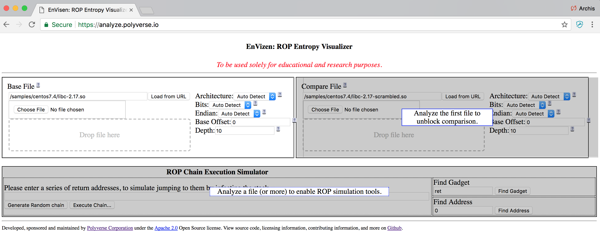
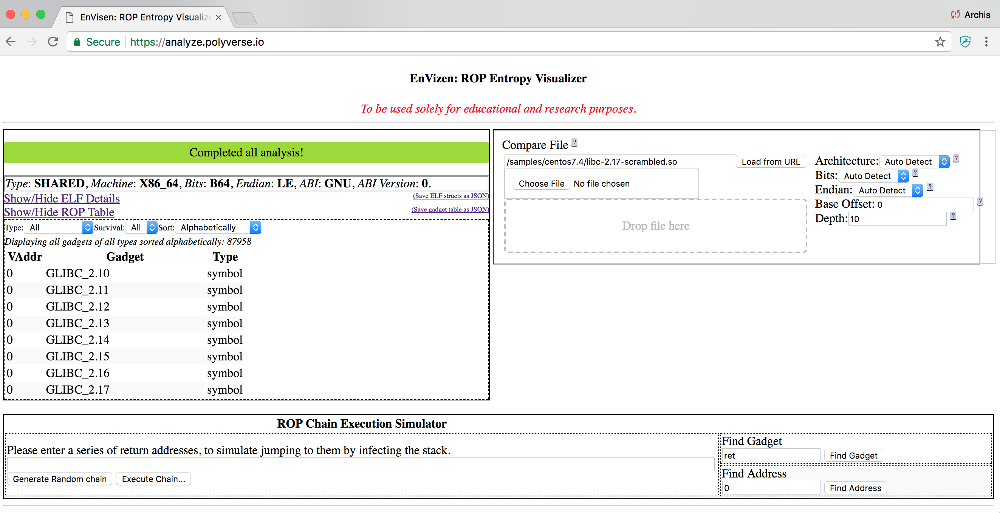
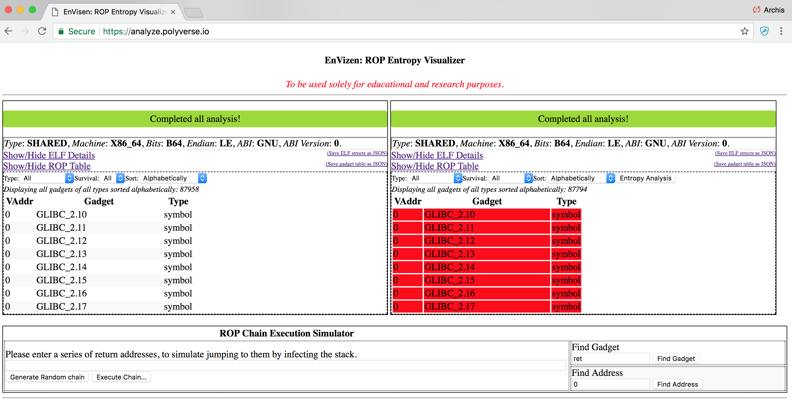
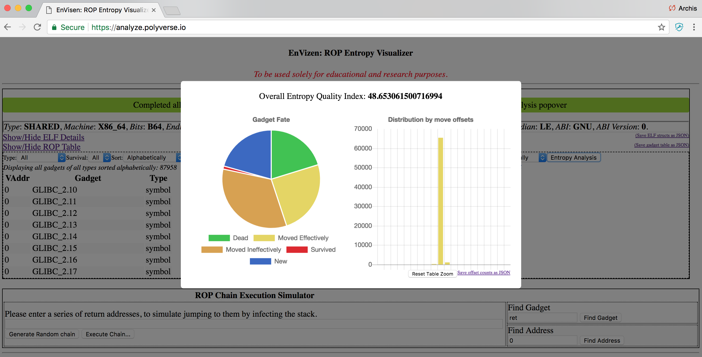
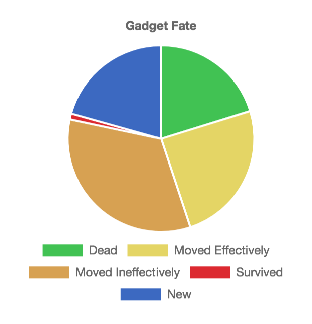

# EnVisen User Guide

EnVisen dissects your binaries in the convenience of your web browser!

## Hello World

Visit EnVisen at https://analyze.polyverse.io.

Click on the button "Load from URL" in the Base File section.

Now the Compare File section gets unblocked. Click on "Load from URL"
on this section as well.

You should see the button "Entropy Analysis" open up. Click on that.

You just dissected Libc from CentOS 7.4, extracted all exported symbols
from the ELF header, disassembled the executable sections, and found
Return Oriented Programming gadgets. You then compared all that information
with another binary (a scrambled variant) and made a comparison.

## The Entropy Quality Index

The [Entropy Index](entropy-index.md) is a one-dimensional measure
of difficulty of crafting a memory-based control-flow attack against the Compared binary
based on how much entropy there exists between the Base and Compared files.

This tells us how effective scrambling was in any particular instance.

## Reading the Chart

This chart displays the fate of ROP gadgets from the Base Binary to the
Compared Binary.

The Blue pie section describes gadgets that never existed
in the Base Binary at all.

The Green pie section describes gadgets that
existed in Base but not in Compared (this they were killed.)

The Red section are gadgets that existed in both binaries.

The yellow sections describe gadgets that were moved. Some effectively (thus
neutralizing any chance that their moved positions could be predirected)
and others ineffectively (thus their movement is relatively low-cost to guess.)
